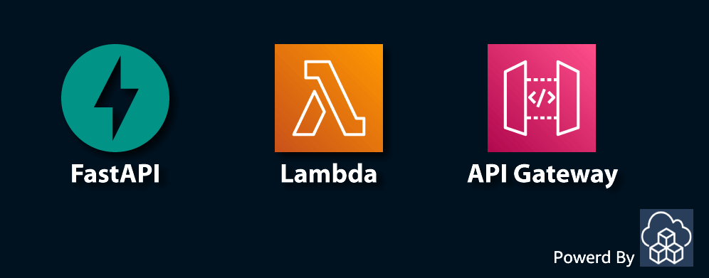

<p align="center">
  <a href="https://dev.to/vumdao">
    
  </a>
</p>
<h1 align="center">
  <div><b>FastApi With AWS Serverless</b></div>
</h1>

## Abstract
- Deploy FastAPI in a Lambda function that is fronted by an HTTP API in API Gateway, you can enable API key required for the API

## Table Of Contents
 * [Solution overview](#Solution-overview)
 * [Build FastAPI as lambda funnction handler](#Build-FastAPI-as-lambda-funnction-handler)
 * [Deploy](#Deploy)
 * [Test API](#Test-API)
 * [Conclusion](#Conclusion)

---

## 🚀 **Solution overview** <a name="Solution overview"></a>


- Use AWS APIGW to build simple API server with lambda integration
- APIGW route paths such as `/api/v1/` and `/chat_gpt/` require API key (with usage plan)
- Lambda function contains FastApi code to serves API requests and respose.

- Let's see the stack relationships

  

## 🚀 **Build FastAPI as lambda funnction handler** <a name="Build-FastAPI-as-lambda-funnction-handler"></a>
- Lambda handler source code

  ```
  ➜  simple-serverless-fastapi tree src/lambda-handler
  src/lambda-handler
  ├── api
  │   └── api_v1
  │       ├── api.py
  │       └── endpoints
  │           └── users.py
  ├── main.py
  └── requirements.txt

  4 directories, 4 files
  ```

- Direct route paths include `/` and `chat_gpt`
  ```
  @app.get("/")
  async def root():
      return {"message": "FastAPI running in a Lambda function"}


  @app.get("/chat_gpt/")
  async def read_chatgpt(question: str = None):
      return {"message": f"We got question: {question}"}
  ```

- Restructure FastAPI Routing for developing API and optimize source code by using `APIRouter`
  ```
  src/lambda-handler/api
  └── api_v1
      ├── api.py
      └── endpoints
          └── users.py
  ```

  ```
  from api.api_v1.api import router as api_router
  app.include_router(api_router, prefix="/api/v1")
  ```

- For lambda function handler, we use [`Mangum`](https://pypi.org/project/mangum/) python module which is an adapter for running ASGI applications in AWS Lambda to handle Function URL, API Gateway, ALB, and Lambda@Edge events.

- For building API Docs, must set following parameters in `FastApi()` constructor to resolve `/openapi.json` correctly
  - For API URL using APIGW stage URL, set `root_path` equal to the API stage name, eg. `root_path=/AppAPI`
  - For API custom domain
    ```
    docs_url='/docs',
    openapi_url='/openapi.json',
    ```

## 🚀 **Deploy** <a name="Deploy"></a>
- For production, build CDK pipeline for this is the best practice.
- For demo, I run `cdk deploy` manually
  ```
  ➜  simple-serverless-fastapi cdk deploy
   ✅  SimpleFastApiServerless

  ✨  Deployment time: 72.44s
  ```

- The API GW and method request

  

  

- Custom domain mapped to the API

  

## 🚀 **Test API** <a name="Test-API"></a>
- Open API Docs

  

- Call `/chat_gpt` with API key and query `question`

  ```
  ➜  simple-serverless-fastapi curl -X GET -H "Content-Type: application/json" -H 'x-api-key: 6sUnYj8PAw8MKu8O6FqSw1kf1clmC0Fx8ilQhVeO' https://chatgpt.simflexcloud.com/chat_gpt/ -d 'question=how%20are%20you' -G
  {"message":"We got question: how are you"}
  ```

- The deploy stage creates codedeploy deployment ID to perform deployment process and handle Traffic shifting progress strategy with rule `LINEAR_10PERCENT_EVERY_1MINUTES` (CodeDeploy predefined deployment configuration that shifts 10 percent of traffic every minute until all traffic is shifted)

  

## 🚀 **Conclusion** <a name="Conclusion"></a>
- We created a FastAPI application using AWS Serverless. User must provide API key to query reqest and the API key is associated with the usage plan where we can specify who can access the deployed API stages and methods, optionally sets the target request rate to start throttling requests.

---
References:
- [Simple Serverless FastAPI with AWS Lambda](https://www.deadbear.io/simple-serverless-fastapi-with-aws-lambda/)

---
<h3 align="center">
  <a href="https://dev.to/vumdao">:stars: Blog</a>
  <span> · </span>
  <a href="https://github.com/vumdao/ecs-blue-green-deployments">Github</a>
  <span> · </span>
  <a href="https://stackoverflow.com/users/11430272/vumdao">stackoverflow</a>
  <span> · </span>
  <a href="https://www.linkedin.com/in/vu-dao-9280ab43/">Linkedin</a>
  <span> · </span>
  <a href="https://www.linkedin.com/groups/12488649/">Group</a>
  <span> · </span>
  <a href="https://www.facebook.com/CloudOpz-104917804863956">Page</a>
  <span> · </span>
  <a href="https://twitter.com/VuDao81124667">Twitter :stars:</a>
</h3>